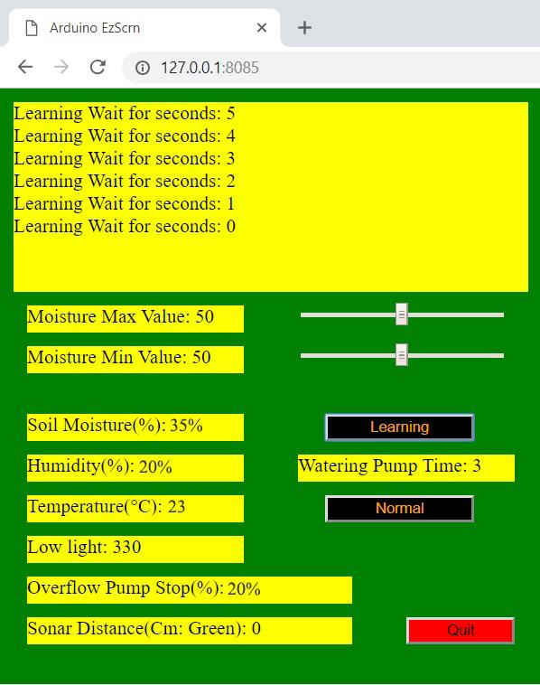

# Automated_Plant_Watering

This repo represents the work of Thishone Wijayakumar, Jin Taek Lee and Ajo Cherian Thomas in completing their Capstone Project for ESD 2018.  The goal of the project was to create a hardware and software product that would automatically detect when the soil around a plant was dry and then use an Arduino to automatically control a relay which would turn on a small water pump.

# User Interface

The project comes with a user interface that was created using 'EzScrn':

# Materials

- A cheap Arduino from eBay ~$5.00 CAD.
- A capacitive moisture sensor purchased from eBay that had the title 'Soil Hygrometer Detection Module Moisture ESP32 DHT11 Sensor for Arduino CP2104' from eBay user alice1101983. ~$3.50CAD
- An air humidity and temperature sensor purchased from eBay that had the title 'DHT11 Temperature and Relative Humidity Sensor Module for arduino' from eBay user survy2014. ~$1.50 CAD
- A photoresistor from eBay that had the title '10 pcs Photo Light Sensitive Resistor Photoresistor Optoresistor 12mm GL12528' from eBay user umisky 2014. ~$1.00 CAD per unit.
- A 5V DC water pump purchased from eBay that had the title 'Ultra-quiet Mini DC 3-6V 120L/H Brushless Motor Submersible Water Pump New' from eBay user alice1101983 ~$2.00 CAD.
- A 5V relay purchased from eBay that had the title '5V 1/2/4/6/8 Channel Relay Board Module Optocoupler LED for Arduino PiC ARM AVR' from eBay user alice1101983 ~$1.50 CAD.
- A HC SR04 ultrasonic sensor purchased from an unknown location.

# Further Reading

See http://blog.robertelder.org/automated-plant-watering-arduino/
